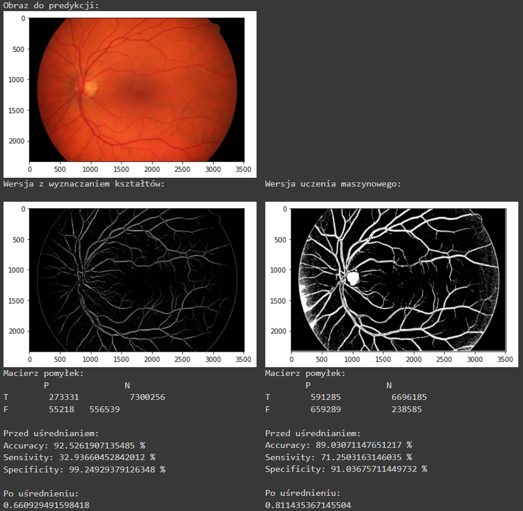
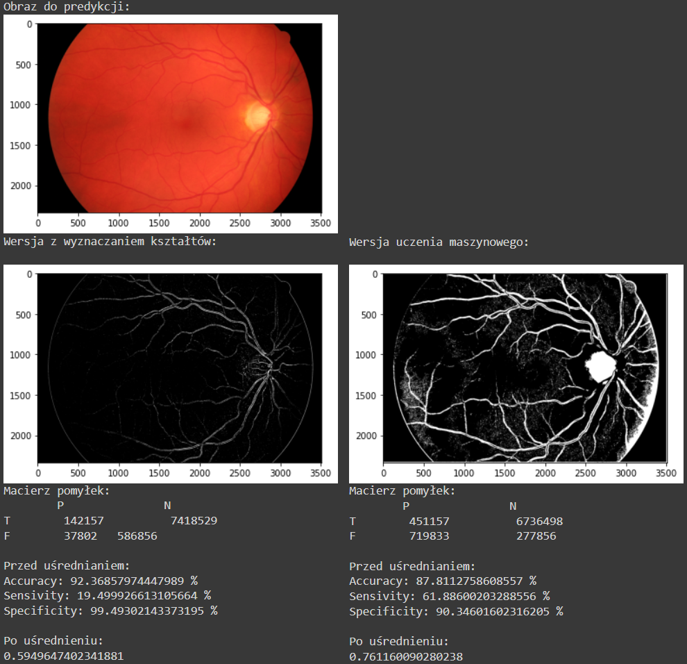
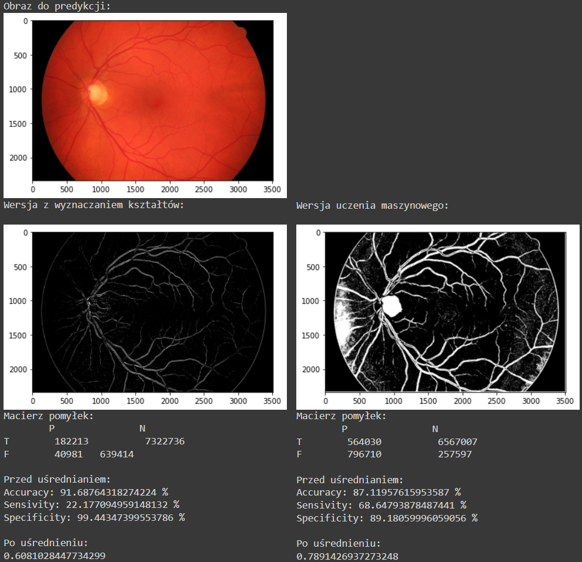
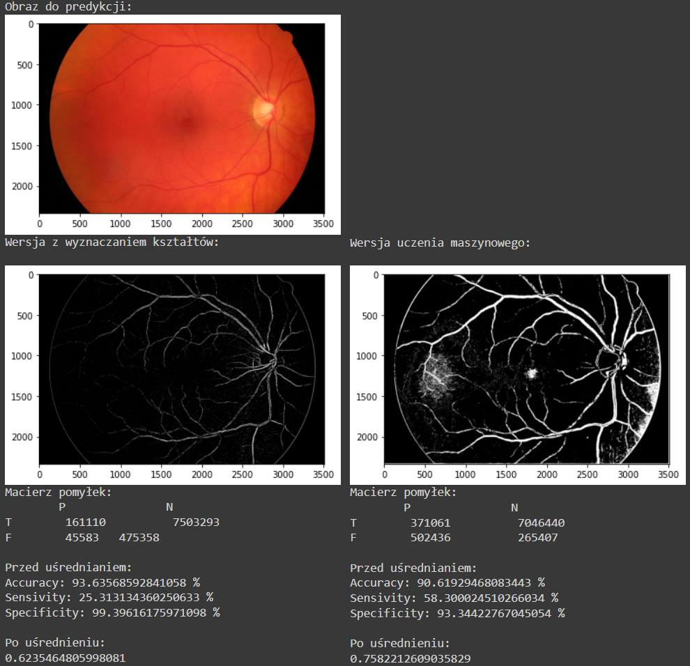
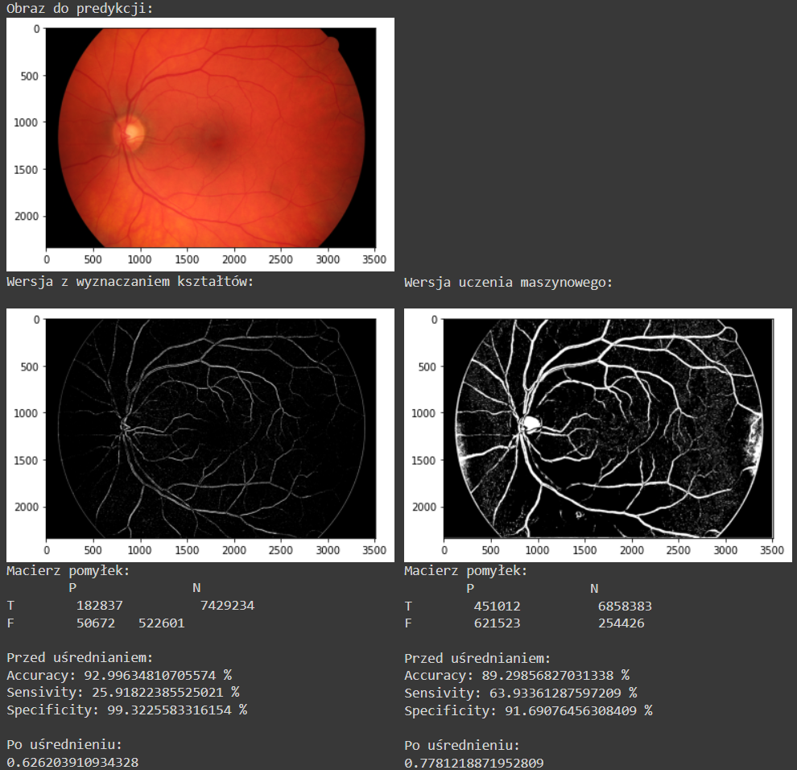

# eye_veins_detector
Program written in Python and Jupiter Notebook for "Informatics in medicine" ("Informatyka w medycynie") classes at the Poznań University of Technology in the summer term 2021/22

Please note that all photos are from original version with polish language. Current version have all of polish language replaced with english.

I also DO NOT own photos eyes presented here. They all were downloaded from medical site, which I currently don't remember.

Examples:

